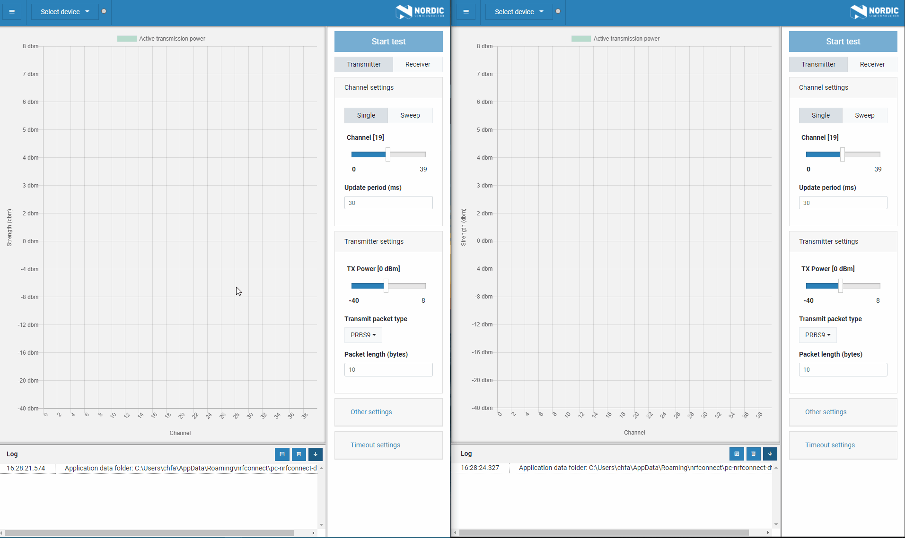

# nRF Connect Direct Test Mode

*nRF Connect Direct Test Mode* lets you perform RF PHY testing of Bluetooth Low Energy devices with the Bluetooth specified Direct Test Mode. See the [Bluetooth Core specification](https://www.bluetooth.com/specifications/bluetooth-core-specification/) (volume 6, part F) for more information on the Direct Test Mode specification.

## Installation

See the [InfoCenter](https://infocenter.nordicsemi.com/index.jsp?topic=%2Fstruct_nrftools%2Fstruct%2Fnrftools_nrfconnect.html) pages for information on how to install the application.

## Development

See the [app development](https://nordicsemiconductor.github.io/pc-nrfconnect-docs/) pages for details on how to develop apps for the nRF Connect for Desktop framework.

## Feedback

Please report issues on the [DevZone](https://devzone.nordicsemi.com) portal.

## Contributing

See the [infos on contributing](https://nordicsemiconductor.github.io/pc-nrfconnect-docs/contributing) for details.

## License

See the [LICENSE](LICENSE) file for details.
